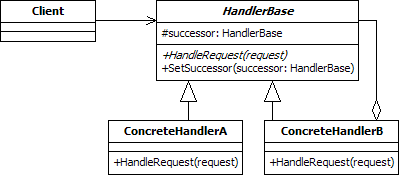

Chain of responsibility is a behavioural pattern as it defines a manner for controlling communication between classes or entities. The chain of responsibility 
pattern is used to process varied requests, each of which may be dealt with by a different handler. The design pattern promotes loose coupling by allowing a 
series of handlers to be created in a linked list or chain. The request is passed to the first handler in the chain, which will either process it or pass it on 
to its successor. This continues until the request is processed or the end of the chain is reached. The handler responsible for the final processing of the 
request need not be known beforehand.

This style of processing is used by the exception handling system in C#. When an exception is thrown, the method that caused the exception is given the chance to
process it, via a try-catch block. If no suitable catch is available, the exception moves up to the calling method, which may include a try-catch. This continues
until the exception is handled or until there are no more possible handlers. The try-catch block itself can be thought of as using the chain of responsibility 
when multiple catches, each for a different type of exception, are given the option to handle an exception.

  

The UML class diagram above describes an implementation of the chain of responsibility design pattern. The items in the diagram are described below:
- **Client.** The client is the class that generates the request and passes it to the first handler in the chain of responsibility.
- **HandlerBase.** This is the abstract base class for concrete handlers. It contains a member that holds the next handler in the chain and an associated method 
to set this successor. It also includes an abstract method that must be implemented by classes that inherit from it. The implementations of this method must either
handle the request or pass it to the next object in the pipeline.
- **ConcreteHandler.** The concrete handlers each inherit from HandlerBase. They include the functionality to handle some requests and pass others to the next item
in the chain, should there be one.