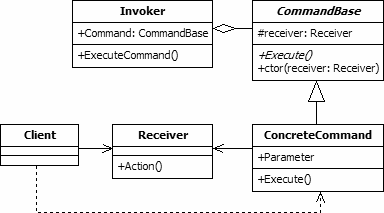

Command is a behavioural pattern as it defines a manner for controlling communication between classes or entities. The command pattern is used to express a request,
including the call to be made and all of its required parameters, in a command object. The command may then be executed immediately or held for later use. Often a 
queue of commands will be created that can be executed in a batch.

The command object does not contain the functionality that is to be executed, only the information required to perform an action. The functionality is contained 
within receiver objects. This removes the direct link between the command definitions and the functionality, promoting loose coupling. Neither of these object 
types is responsible for determining the time of execution of the command. This is controlled using an invoker.

The command pattern is useful when supporting activities that require the execution of a series of commands. The command objects can be held in a queue and 
processed sequentially. If each command is stored on a stack after it is executed, and if the commands are reversible, this allows the implementation of a rollback
or multi-level undo facility.

  

The UML class diagram above shows an implementation of the command design pattern. The items in the diagram are described below:
- **Client.** The class is a consumer of the classes of the command design pattern. It creates the command objects and links them to receivers.
- **Receiver.** Receiver objects contain the methods that are executed when one or more commands are invoked. This allows the actual functionality to be held 
separately to the Command definitions.
- **CommandBase.** This abstract class is the base class for all command objects. It defines a protected field that holds the Receiver that is linked to the 
command, which is usually set via a constructor. The class also defines an abstract method that is used by the Invoker to execute commands.
- **ConcreteCommand.** Concrete command classes are subclasses of CommandBase. In addition to implementing the Execute method, they contain all of the information 
that is required to correctly perform the action using the linked Receiver object.
- **Invoker.** The Invoker object initiates the execution of commands. The invoker could be controlled by the Client object or may be disconnected from the client. 
For example, the client could create a queue of commands that are executed periodically by a timed event.