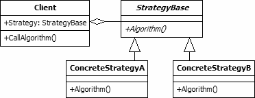

Strategy is a behavioural pattern as it defines a manner for controlling communication between classes or entities. 

The strategy pattern is used to create an interchangeable family of algorithms from which the required process is chosen at run-time. This allows the behaviour of 
a program to change dynamically according to configuration details or user preferences. It also increases flexibility by allowing new algorithms to be easily 
incorporated in the future.

  

The UML class diagram above describes an implementation of the strategy design pattern. The items in the diagram are described below:
- **Client.** This class is the user of an interchangeable algorithm. The class includes a property to hold one of the strategy classes. This property will be set 
at run-time according to the algorithm that is required.
- **StrategyBase.** This abstract class is the base class for all classes that provide algorithms. In the diagram the class includes a single method. However, 
there is no reason why a number of properties and methods may not be included. This class may be implemented as an interface if it provides no real functionality 
for its subclasses.
- **ConcreteStrategy A/B.** The concrete strategy classes inherit from the StrategyBase class. Each provides a different algorithm that may be used by the client.