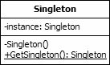

Singleton is a creational pattern as it is used to control class instantiation. The pattern ensures that only one object of a particular class is ever created. 
All further references to objects of the singleton class refer to the same underlying instance.

The singleton pattern is useful when a single, global point of access to a limited resource is required. It is more appropriate than creating a global variable as 
this may be copied, leading to multiple access points and the risk that the duplicates become out of step with the original.

  

The UML class diagram above describes an implementation of the singleton pattern. In this diagram the only public interface element is the static "GetSingleton" 
method. This method returns the single instance held in the private "instance" variable. Usually an instance of the class is created only when first requested. 
This lazy initialization ensures that if the class is never required, resources are not wasted.

The constructor for the class is marked as private. This prevents any external classes from creating new instances. The class is also sealed to prevent inheritance,
which could lead to sub-classing that breaks the singleton rules.