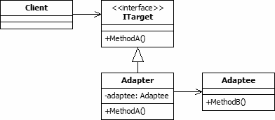

Adapter is a structural pattern as it defines a manner for creating relationships between classes. The adapter design pattern is used to provide a link between two
otherwise incompatible types by wrapping the "adaptee" with a class that supports the interface required by the client.

  

The UML class diagram above describes an implementation of the adapter design pattern. The items in the diagram are described below:
- **Client.** The client class is that which requires the use of an incompatible type. It expects to interact with a type that implements the ITarget interface. 
However, the class that we wish it to use is the incompatible Adaptee.
- **ITarget.** This is the expected interface for the client class. Although shown in the diagram as an interface, it may be a class that the adapter inherits. If 
a class is used, the adapter must override its members.
- **Adaptee.** This class contains the functionality that is required by the client. However, its interface is not compatible with that which is expected.
- **Adapter.** This class provides the link between the incompatible Client and Adaptee classes. The adapter implements the ITarget interface and contains a 
private instance of the Adaptee class. When the client executes MethodA on the ITarget interface, MethodA in the adapter translates this request to a call to 
MethodB on the internal Adaptee instance.